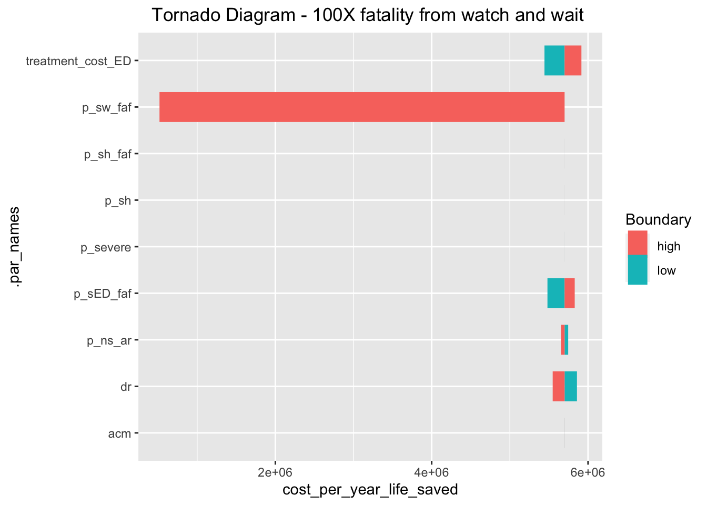
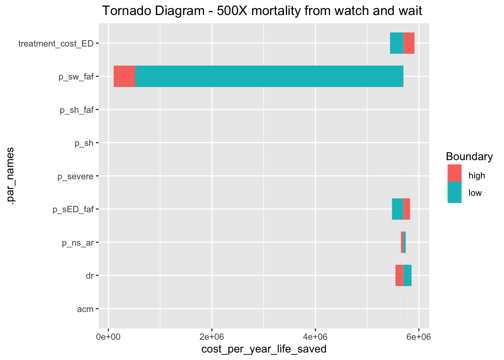

## Build the allergy model


::: {.cell}

```{.r .cell-code}
library(tidyverse)
```

::: {.cell-output .cell-output-stderr}
```
── Attaching core tidyverse packages ──────────────────────── tidyverse 2.0.0 ──
✔ dplyr     1.1.2     ✔ readr     2.1.4
✔ forcats   1.0.0     ✔ stringr   1.5.0
✔ ggplot2   3.4.2     ✔ tibble    3.2.1
✔ lubridate 1.9.2     ✔ tidyr     1.3.0
✔ purrr     1.0.1     
── Conflicts ────────────────────────────────────────── tidyverse_conflicts() ──
✖ dplyr::filter() masks stats::filter()
✖ dplyr::lag()    masks stats::lag()
ℹ Use the conflicted package (<http://conflicted.r-lib.org/>) to force all conflicts to become errors
```
:::

```{.r .cell-code}
library(heemod)
```

::: {.cell-output .cell-output-stderr}
```

Attaching package: 'heemod'

The following object is masked from 'package:purrr':

    modify
```
:::

```{.r .cell-code}
library(diagram)
```

::: {.cell-output .cell-output-stderr}
```
Loading required package: shape
```
:::

```{.r .cell-code}
library(ggplot2)

# import the Canada 2020 life table with mortality value in all ages (both sex)

life_table<-read.csv('./life_table_CAN_2020.csv')

#remove row 111 from life_table (age older than 111 )
life_table <- life_table %>% 
                filter(Age.group != "110 years and over") %>% 
                separate(Age.group, into = c("Age", "Unit"), sep = " ") %>% 
                select(Age, VALUE) %>% 
                mutate(Age=as.numeric(Age), fatality_daily = rescale_prob(p = VALUE, from = 365 ))


  
#build age parameter,
par_allerg <-define_parameters(
                  age_initial = 1,
                  age = floor(age_initial + markov_cycle/365)
)
```

::: {.cell-output .cell-output-stderr}
```
Warning: markov_cycle was deprecated in heemod 0.16.0.
ℹ Please use model_time instead.
ℹ The deprecated feature was likely used in the base package.
  Please report the issue to the authors.
```
:::

```{.r .cell-code}
#age-dependent remission probability
ar_age<-function(age) {if_else(age <=6, rescale_prob(0.058,from = 365), 0) 
}

#_ww: watch and wait scenario
#_ED: transfer to ED scenario 
#ns: non severe
#sw: severe watch and wait,
#sED: severe transfer to ED,
#sh: severe with hospitalized, 
#ar: food allergy remission, 
#faf: food allergy fatality,
#dr: discount rate
#acm: all-cause mortality


par_allerg<-modify(
par_allerg,
p_severe = 0.087,
p_ns_ar = ar_age(age = age) , # transition from non-severe reaction to food allergy remission
p_ns_sw_ww = (1-0.14) * rescale_prob(p =p_severe, from = 365) , # non-severe reaction to severe reaction for watch and wait
p_ns_sED_ww =  0.14 * rescale_prob(p = p_severe, from = 365), # non-severe reaction to severe reaction transfer to ED for watch and wait
p_sh = 0.121, #transition from severe state to hospitalization 
p_sw_faf = rescale_prob(p = 0.00002, from = 365), # Watch and wait to food allergy fatality
p_sED_faf = rescale_prob(p = 0.000002, from = 365), # transition from ED to food allergy fatality
p_ns_sED_ED= rescale_prob(p =p_severe, from = 365), # transition from non-severe to ED
p_sh_faf= 0.0045, # transition from hospitalization to food allergy fatality # old value 0.0045 
acm = look_up(data = life_table, Age = age, value = "fatality_daily"), #daily all-cause mortality
dr=rescale_prob( p=0.015, from = 365),
treatment_cost_ED=0.8 +51.3

  )

#transition matrix for ED transfer 
Transition_ED <- define_transition(
  state_names = c("state_ar","state_ns", "state_sw", "state_sED", "state_sh", "state_faf","state_acm"),
  C,            0,      0,           0,       0,         0,      acm,
  p_ns_ar,      C,      0, p_ns_sED_ED,       0,         0,      acm,
  0,            0,      0,           0,       0,         1,        0,
  0,            C,      0,           0,    p_sh, p_sED_faf,      acm,
  0,            C,      0,           0,       0,  p_sh_faf,      acm,
  0,            0,      0,           0,       0,         1,        0,
  0,            0,      0,           0,       0,         0,        1
)

#transition matrix for watch and wait
Transition_watch <- define_transition(
  state_names = c("state_ar","state_ns", "state_sw", "state_sED", "state_sh", "state_faf","state_acm"),
  C,          0,     0,          0,           0,        0,         acm,
  p_ns_ar,    C,     p_ns_sw_ww, p_ns_sED_ww, 0,        0,         acm,
  0,          C,     0,          0,           p_sh,  p_sw_faf,  acm,
  0,          C,     0,          0,           p_sh, p_sED_faf, acm,
  0,          C,     0,          0,           0,        p_sh_faf,  acm,
  0,          0,     0,          0,           0,        1,           0,
  0,          0,     0,          0,           0,        0,           1
)


# food allergy remission 
state_ar<-define_state(
  remission_cost= 513/365,
  medical_cost = 0,
  treatment_cost = 0,
  ambulance_cost = 0,
  medical_cost_ED = 0,
  medical_cost_hospitalized =0,
  utility =0.93,
  cost_total = discount(remission_cost, r=dr),
  utility_total = discount(utility, r=dr)
)

# non-severe reaction
state_ns<-define_state(
  remission_cost= 0,
  medical_cost = 1254/365,
  treatment_cost = 0,
  ambulance_cost = 0,
  medical_cost_ED = 0,
  medical_cost_hospitalized =0,
  utility = 0.92,
  cost_total = discount(medical_cost, r=dr),
  utility_total = discount(utility, r=dr)
)

#severe allergic reaction-watch and waiting 
state_sw<-define_state(
  remission_cost= 0,
  medical_cost = 1254/365,
  treatment_cost = 95,
  ambulance_cost = 0,
  medical_cost_ED = 0,
  medical_cost_hospitalized =0,
  utility = 0.83,
  cost_total = discount(medical_cost+treatment_cost, r=dr),
  utility_total = discount(utility, r=dr)
)

#severe allergic reaction - ED transfer 
#medical cost =direct cost of food allergy/year+ED medical cost
state_sED<- define_state(
  remission_cost= 0,
  medical_cost = 1254/365, 
  treatment_cost = treatment_cost_ED,
  ambulance_cost = 848,
  medical_cost_ED = 331,
  medical_cost_hospitalized =0,
  utility =0.83,
  cost_total = discount(medical_cost + treatment_cost + ambulance_cost + medical_cost_ED , r=dr),
  utility_total = discount(utility, r=dr)
)

#severe allergic reaction -hospitalized 
state_sh<-define_state(
  remission_cost= 0,
  medical_cost = 0,
  treatment_cost = 0,
  ambulance_cost = 0,
  medical_cost_ED = 0,
  medical_cost_hospitalized =1866,
  utility = 0.83,
  cost_total = discount(medical_cost_hospitalized,r=dr),
  utility_total = discount(utility, r=dr)
)


#food allergy fatality
state_faf<-define_state(
  remission_cost= 0,
  medical_cost =0, 
  medical_cost_hospitalized = 0,
  treatment_cost = 0,
  ambulance_cost = 0,
  medical_cost_ED = 0,
  utility = 0,
  cost_total = 0,
  utility_total = 0
)

#all-cause mortality
state_acm<-define_state(
  remission_cost= 0,
  medical_cost =0, 
  medical_cost_hospitalized = 0,
  treatment_cost = 0,
  ambulance_cost = 0,
  medical_cost_ED = 0,
  utility = 0,
  cost_total = 0,
  utility_total = 0
)

strategy_ED<-define_strategy(
  transition = Transition_ED,
  state_ar = state_ar,
  state_ns = state_ns,
  state_sw = state_sw,
  state_sED = state_sED,
  state_sh = state_sh,
  state_faf = state_faf,
  state_acm = state_acm
)

strategy_watch<- define_strategy(
  transition = Transition_watch,
  state_ar = state_ar,
  state_ns = state_ns,
  state_sw = state_sw,
  state_sED = state_sED,
  state_sh = state_sh,
  state_faf = state_faf,
  state_acm = state_acm
)


time0 <- define_init(state_ar = 0,
                     state_ns = 10000,
                     state_sw = 0,
                     state_sED= 0,
                     state_sh = 0,
                     state_faf= 0,
                     state_acm=0)

allergy_mod<-run_model(
                parameters = par_allerg,
                ED_transfer = strategy_ED,
                watch_wait = strategy_watch,
                init = time0,
                cycles = 20*365,
                cost = cost_total,
                effect = utility,
                central_strategy ="ED_transfer"
)

summary(allergy_mod)
```

::: {.cell-output .cell-output-stdout}
```
2 strategies run for 7300 cycles.

Initial state counts:

state_ar = 0
state_ns = 10000
state_sw = 0
state_sED = 0
state_sh = 0
state_faf = 0
state_acm = 0

Counting method: 'life-table'.

 

Counting method: 'beginning'.

 

Counting method: 'end'.

Values:

            remission_cost medical_cost treatment_cost ambulance_cost
ED_transfer       26493823    185606734       701600.3       11419521
watch_wait        26493823    185606727      1198430.2        1598733
            medical_cost_ED medical_cost_hospitalized  utility cost_total
ED_transfer       4457383.7                   3040137 67233340  200801624
watch_wait         624033.7                   3040137 67233338  189363793
            utility_total
ED_transfer      58026195
watch_wait       58026193

Efficiency frontier:

watch_wait -> ED_transfer

Differences:

            Cost Diff. Effect Diff.    ICER       Ref.
ED_transfer   1143.783 0.0002006633 5700011 watch_wait
```
:::
:::


## Calculate the reference cost_per_year_saved value


::: {.cell}

```{.r .cell-code}
value<-get_values(allergy_mod)

tmp <- get_counts(allergy_mod)

tmp %>%   
  group_by(.strategy_names, state_names) %>% 
  summarize(avg=mean(count), sum=sum(count))
```

::: {.cell-output .cell-output-stderr}
```
`summarise()` has grouped output by '.strategy_names'. You can override using
the `.groups` argument.
```
:::

::: {.cell-output .cell-output-stdout}
```
# A tibble: 14 × 4
# Groups:   .strategy_names [2]
   .strategy_names state_names      avg       sum
   <chr>           <chr>          <dbl>     <dbl>
 1 ED_transfer     state_acm     13.1      95697.
 2 ED_transfer     state_ar    2582.    18850381.
 3 ED_transfer     state_faf      3.84     28005.
 4 ED_transfer     state_ns    7399.    54010822.
 5 ED_transfer     state_sED      1.84     13466.
 6 ED_transfer     state_sh       0.223     1629.
 7 ED_transfer     state_sw       0            0 
 8 watch_wait      state_acm     13.1      95697.
 9 watch_wait      state_ar    2582.    18850381.
10 watch_wait      state_faf      3.84     28007.
11 watch_wait      state_ns    7399.    54010820.
12 watch_wait      state_sED      0.258     1885.
13 watch_wait      state_sh       0.223     1629.
14 watch_wait      state_sw       1.59     11581.
```
:::

```{.r .cell-code}
value_summary<-value %>%   
  group_by(.strategy_names, value_names) %>% 
      summarize(sum=sum(value)) 
```

::: {.cell-output .cell-output-stderr}
```
`summarise()` has grouped output by '.strategy_names'. You can override using
the `.groups` argument.
```
:::

```{.r .cell-code}
print(value_summary)
```

::: {.cell-output .cell-output-stdout}
```
# A tibble: 18 × 3
# Groups:   .strategy_names [2]
   .strategy_names value_names                      sum
   <chr>           <chr>                          <dbl>
 1 ED_transfer     ambulance_cost             11419521.
 2 ED_transfer     cost_total                200801624.
 3 ED_transfer     medical_cost              185606734.
 4 ED_transfer     medical_cost_ED             4457384.
 5 ED_transfer     medical_cost_hospitalized   3040137.
 6 ED_transfer     remission_cost             26493823.
 7 ED_transfer     treatment_cost               701600.
 8 ED_transfer     utility                    67233340.
 9 ED_transfer     utility_total              58026195.
10 watch_wait      ambulance_cost              1598733.
11 watch_wait      cost_total                189363793.
12 watch_wait      medical_cost              185606727.
13 watch_wait      medical_cost_ED              624034.
14 watch_wait      medical_cost_hospitalized   3040137.
15 watch_wait      remission_cost             26493823.
16 watch_wait      treatment_cost              1198430.
17 watch_wait      utility                    67233338.
18 watch_wait      utility_total              58026193.
```
:::

```{.r .cell-code}
# calculate cost difference between ED transfer and watch and wait in allergy model 
cost_diff_refer <- value_summary$sum[value_summary$.strategy_names == "ED_transfer" & value_summary$value_names == "cost_total"] -
                        value_summary$sum[value_summary$.strategy_names == "watch_wait" & value_summary$value_names == "cost_total"] 


#calculate utility difference between ED transfer and watch and wait in allergy 
utility_diff_refer<-value_summary$sum[value_summary$.strategy_names == "ED_transfer" & value_summary$value_names == "utility"] -
  value_summary$sum[value_summary$.strategy_names == "watch_wait" & value_summary$value_names == "utility"] 

#calculate the cost per year life saved in allergy model
cost_per_year_life_saved_ref<-cost_diff_refer/utility_diff_refer
print(cost_per_year_life_saved_ref)
```

::: {.cell-output .cell-output-stdout}
```
[1] 5700011
```
:::
:::


## Sensitivity analysis

-   treatment cost in the ED range from \$0.8-95,
-   wathc_wait: Food allergy fatality tested sepeatedly for X100, X500, and X1000 compared to ED transfert.
-   other parameters are varies from -20% to +20%

1.  **sensitivity analysis parameter with food allergically fatality X100 for watch and wait**


::: {.cell}

```{.r .cell-code}
allergy_sa_100<-define_dsa(
  p_ns_ar, ar_age(age = age)*0.8, ar_age(age = age) *1.2,
  p_sh, 0.121 *0.8,0.121 *1.2,
  p_sED_faf, rescale_prob(p = 0.000002 * 0.8, from = 365) *0.8, rescale_prob(p = 0.000002 *1.2, from = 365) ,
  p_severe, 0.087 *0.8, 0.087 *1.2 ,
  p_sh_faf, 0.0045*0.8,  0.0045*1.2,
  acm, look_up(data = life_table, Age = age, value = "fatality_daily")*0.8, look_up(data = life_table, Age = age, value = "fatality_daily")*1.2,
  dr, rescale_prob( p=0.015, from = 365) *0.8, rescale_prob( p=0.015, from = 365) *1.2,
  treatment_cost_ED, 0.8, 95,
  p_sw_faf, rescale_prob (p = 0.00002, from = 365),rescale_prob(p = 0.0002, from = 365) #fatality increase to 100,lower is original
)

#run sensitivity analysis 
allergy_dsa_100 <-run_dsa(
  model = allergy_mod,
  dsa = allergy_sa_100
)
```

::: {.cell-output .cell-output-stderr}
```
Running DSA on strategy 'ED_transfer'...
```
:::

::: {.cell-output .cell-output-stderr}
```
Running DSA on strategy 'watch_wait'...
```
:::

```{.r .cell-code}
#draw tornado graph, category boundary into low and high 
allergy_dsa_100_data<-as.data.frame(allergy_dsa_100$dsa)

allergy_dsa_100_clean<-allergy_dsa_100_data %>%
  select(
    .strategy_names, .par_names, .par_value, .cost, .effect, .n_indiv )%>% 
  mutate(
    Boundary = rep(c("low","high"), length.out = nrow(allergy_dsa_100_data))) 

allergy_dsa_100_gd<-allergy_dsa_100_clean %>% 
  group_by(.par_names, .par_value, Boundary) %>%
 summarise( cost_diff =.cost[.strategy_names == "ED_transfer"] - .cost[.strategy_names == "watch_wait"],
   effect_diff = .effect[.strategy_names == "ED_transfer"] -.effect[.strategy_names == "watch_wait"]) %>%
  mutate(cost_per_year_life_saved = cost_diff/effect_diff)
```

::: {.cell-output .cell-output-stderr}
```
`summarise()` has grouped output by '.par_names', '.par_value'. You can
override using the `.groups` argument.
```
:::

```{.r .cell-code}
allergy_dsa_100_tor<- ggplot(allergy_dsa_100_gd, aes(
  y = .par_names,
  yend=.par_names,
  x = cost_per_year_life_saved,
  xend = cost_per_year_life_saved_ref,
  color = Boundary)) +
  geom_segment(linewidth = 10)  +
  ggtitle("Tornado Diagram - 100X fatality from watch and wait ") +
  theme(plot.title = element_text(hjust = 0.5))

print(allergy_dsa_100_tor)
```

::: {.cell-output-display}
{width=672}
:::
:::


**2. sensitivity analysis parameter with food allergically fatality X500 for watch and wait**


::: {.cell}

```{.r .cell-code}
allergy_sa_500<-define_dsa(
  p_ns_ar, ar_age(age = age)*0.8, ar_age(age = age) *1.2,
  p_sh, 0.121 *0.8,0.121 *1.2,
  p_sED_faf, rescale_prob(p = 0.000002 * 0.8, from = 365) *0.8, rescale_prob(p = 0.000002 *1.2, from = 365) ,
  p_severe, 0.087 *0.8, 0.087 *1.2 ,
  p_sh_faf, 0.0045*0.8,  0.0045*1.2,
  acm, look_up(data = life_table, Age = age, value = "fatality_daily")*0.8, look_up(data = life_table, Age = age, value = "fatality_daily")*1.2,
  dr, rescale_prob( p=0.015, from = 365) *0.8, rescale_prob( p=0.015, from = 365) *1.2,
  treatment_cost_ED, 0.8, 95,
  p_sw_faf, rescale_prob (p = 0.0002, from = 365),rescale_prob(p = 0.001, from = 365) # fatality increase to X500,lower use X100 
)

allergy_dsa_500 <-run_dsa(
  model = allergy_mod,
  dsa = allergy_sa_500
)
```

::: {.cell-output .cell-output-stderr}
```
Running DSA on strategy 'ED_transfer'...
```
:::

::: {.cell-output .cell-output-stderr}
```
Running DSA on strategy 'watch_wait'...
```
:::

```{.r .cell-code}
allergy_dsa_500_data<-as.data.frame(allergy_dsa_500$dsa)

allergy_dsa_500_clean<-allergy_dsa_500_data %>%
  select(
    .strategy_names, .par_names, .par_value, .cost, .effect, .n_indiv )%>% 
  mutate(
    Boundary = rep(c("low","high"), length.out = nrow(allergy_dsa_500_data))) 

allergy_dsa_500_gd<-allergy_dsa_500_clean %>% 
  group_by(.par_names, .par_value, Boundary) %>%
  summarise( cost_diff =.cost[.strategy_names == "ED_transfer"] - .cost[.strategy_names == "watch_wait"],
             effect_diff = .effect[.strategy_names == "ED_transfer"] -.effect[.strategy_names == "watch_wait"]) %>%
  mutate(cost_per_year_life_saved = cost_diff/effect_diff)
```

::: {.cell-output .cell-output-stderr}
```
`summarise()` has grouped output by '.par_names', '.par_value'. You can
override using the `.groups` argument.
```
:::

```{.r .cell-code}
allergy_dsa_500_tor<- ggplot(allergy_dsa_500_gd, aes(
  y = .par_names,
  yend=.par_names,
  x = cost_per_year_life_saved,
  xend = cost_per_year_life_saved_ref,
  color = Boundary)) +
  geom_segment(linewidth = 10)  +
  ggtitle("Tornado Diagram - 500X mortality from watch and wait ") +
  theme(plot.title = element_text(hjust = 0.5))

print(allergy_dsa_500_tor)
```

::: {.cell-output-display}
{width=672}
:::
:::

**3. sensitivity analysis parameter with food allergically fatality X1000 for watch and wait**


::: {.cell}

```{.r .cell-code}
allergy_sa_1000<-define_dsa(
  p_ns_ar, ar_age(age = age)*0.8, ar_age(age = age) *1.2,
  p_sh, 0.121 *0.8,0.121 *1.2,
  p_sED_faf, rescale_prob(p = 0.000002 * 0.8, from = 365) *0.8, rescale_prob(p = 0.000002 *1.2, from = 365) ,
  p_severe, 0.087 *0.8, 0.087 *1.2 ,
  p_sh_faf, 0.0045*0.8,  0.0045*1.2,
  acm, look_up(data = life_table, Age = age, value = "fatality_daily")*0.8, look_up(data = life_table, Age = age, value = "fatality_daily")*1.2,
  dr, rescale_prob( p=0.015, from = 365) *0.8, rescale_prob( p=0.015, from = 365) *1.2,
  treatment_cost_ED, 0.8, 95,
  p_sw_faf, rescale_prob (p = 0.0010, from = 365),rescale_prob(p = 0.002, from = 365) #fatality increase to 1000,lower is X500
)

allergy_dsa_1000 <-run_dsa(
  model = allergy_mod,
  dsa = allergy_sa_1000
)
```

::: {.cell-output .cell-output-stderr}
```
Running DSA on strategy 'ED_transfer'...
```
:::

::: {.cell-output .cell-output-stderr}
```
Running DSA on strategy 'watch_wait'...
```
:::

```{.r .cell-code}
allergy_dsa_1000_data<-as.data.frame(allergy_dsa_1000$dsa)

allergy_dsa_1000_clean<-allergy_dsa_1000_data %>%
  select(
    .strategy_names, .par_names, .par_value, .cost, .effect, .n_indiv )%>% 
  mutate(
    Boundary = rep(c("low","high"), length.out = nrow(allergy_dsa_1000_data))) 

allergy_dsa_1000_gd<-allergy_dsa_1000_clean %>% 
  group_by(.par_names, .par_value, Boundary) %>%
  summarise( cost_diff =.cost[.strategy_names == "ED_transfer"] - .cost[.strategy_names == "watch_wait"],
             effect_diff = .effect[.strategy_names == "ED_transfer"] -.effect[.strategy_names == "watch_wait"]) %>%
  mutate(cost_per_year_life_saved = cost_diff/effect_diff)
```

::: {.cell-output .cell-output-stderr}
```
`summarise()` has grouped output by '.par_names', '.par_value'. You can
override using the `.groups` argument.
```
:::

```{.r .cell-code}
allergy_dsa_1000_tor<- ggplot(allergy_dsa_1000_gd, aes(
  y = .par_names,
  yend=.par_names,
  x = cost_per_year_life_saved,
  xend = cost_per_year_life_saved_ref,
  color = Boundary)) +
  geom_segment(linewidth = 10)  +
  ggtitle("Tornado Diagram - 1000X fatality from watch and wait ") +
  theme(plot.title = element_text(hjust = 0.5))

print(allergy_dsa_1000_tor)
```

::: {.cell-output-display}
{width=672}
:::
:::

